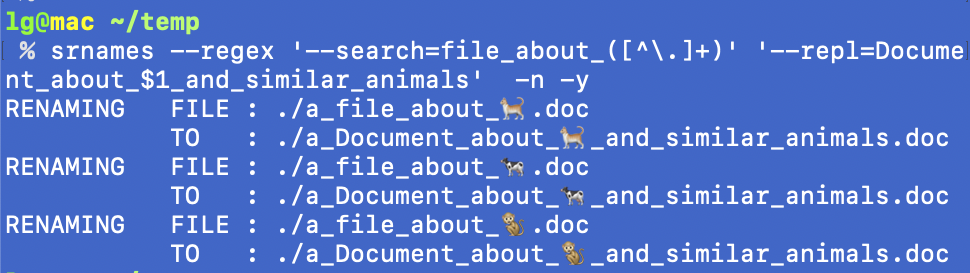
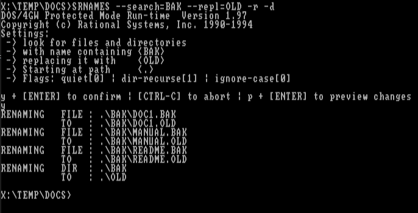
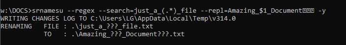
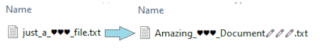

# srnames
Multi-platform search+replace file & directory rename utility.

##### Table of Contents  
[Features](#features)  
[Supported platforms](#platforms)  
[Syntax](#Syntax)  
[Notes](#Notes)  
[Examples](#Examples)  
[Demos](#Demos)  
[Download & binaries](#download)  
[Building](#Building)  
[License](#License)  
[Feedback & Contributing](#Feedback)  

## Features
 - Rename files and/or directories, recursively if needed
 - Regex support
 - Variables in replacement expressions
 - Preview actions without making changes
 - Create changes log, for undo (provided by separate scripts)
 - Unicode support
 - Portable, stand-alone executables
 - Builds without dependencies other than the platform's compiler/SDK

## Platforms
 - macOS
 - Linux
 - Windows (ASCII & Unicode builds)
 - DOS/DPMI, FreeDOS - [experimental, some features are not available]
 
### Syntax
```
srnames - search and replace file/dir names.
  Required:
          --search=str1              String to search to for.
          --repl=str2                Replacement string.
  Options:
      -i, --ignore-case              Ignore case in searches.
      -d, --dirs-too                 Also rename directories (default is files-only.)
      -D, --dirs-only                Only rename directories (no files.)
      -a, --start-at=path            Start searching at given path.
                                     Default is: current directory.
      -r, --recurse                  Recursively include all directories.
          --regex                    Interpret search string as regex.
                                     Makes capture groups available in replacement string.
          --what-if                  Preview results without making any changes.
          --dry-run                  Same as --what-if.
      -q, --quiet                    Do not print changes to stdout.
      -y, --yes                      Skip initial confirmation prompt.
          --chglog=filepath          Log changes (enables undo).
                                     On by default (temp file) for some platforms.
      -n, --no-chglog                Disable changes log.
  Exit codes:                        0 = Success.
                                     1 = Error.
  Regex replacement variables:       $1..n = Capture group n. E.g. 'file_(\d+)'
                                     $&    = The entire regex match
  Repl. string variables:            (applied after regex, when that's available)
                                     #dir  = Parent dir of current item.
                                     #dtm  = YYYYMMDDhhmmss.
                                     #cnt  = Rename counter.
                                     #2cnt = ditto, zero-filled NN.
                                     #3cnt = ditto, zero-filled NNN.
                                     #4cnt = ditto, zero-filled NNNN.
                                     #8cnt = ditto, zero-filled NNNNNNNN.
                                     ##    = literal #.

```
## Notes
### Unicode support
On macOS and Linux Unicode should work out-of-the-box with UTF-8 locales. On working with regular expressions, remember that things like Emoji's do not necessarily count as or expand to a single character. On Windows, there is separate build SRNAMESU.EXE, Unicode will not work with the normal, ASCII-only build SRNAMES.EXE.
### DOS
Unicode support and regular expressions are not available under DOS due to lack of experience building Unicode under DOS and not being able to find a usable std::regex implementation (yet.)
 
## Examples
### change file extension for whole tree
Replace .cpp file extension with .CC for the whole codebase:
```
srnames.exe -r --search=.cpp --repl=.CC --start-at=$HOME/prj/src/
```
### use of cnt variable
Align/anonimize file & directory names, saving the original names to the changelog.
```
srnames.exe -r --regex --search=.* --repl=FILE_#cnt.BIN --chglog=FILECHANGES.LOG --start-at=W:\SHARE\ -q -y 
srnames.exe -r -D --regex --search=.* --repl=DIR#8cnt --chglog=DIRCHANGES.LOG --start-at=W:\SHARE\ -q -y
```
### regex search & replace
Prefix images with parent dir name, preserving image number, so files can be merged into a single directory
```
 % find .
./THUMB
./THUMB/IMG0397.JPG
./THUMB/IMG0437.JPG
./THUMB/IMG0450.JPG
./THUMB/IMG0402.JPG
./img
./PIC/IMG0397.JPG
./PIC/IMG0437.JPG
./PIC/IMG0450.JPG
./PIC/IMG0402.JPG
 # DO notice options have been 'quoted' to prevent the shell from corrputing the passed parameters
 % srnames -r --regex '--search=IMG(\d\d\d\d)' '--repl=#dir_$1' -q -y && 
  mv PIC/* img/ &&
  mv THUMB/* img/
 % find . 
./PIC
./THUMB
./img
./img/PIC_0397.JPG
./img/PIC_0402.JPG
./img/PIC_0437.JPG
./img/PIC_0450.JPG
./img/THUMB_0397.JPG
./img/THUMB_0402.JPG
./img/THUMB_0437.JPG
./img/THUMB_0450.JPG
```

### Rolling-back changes
Creating a changelog is recommended as it makes it possible to undo/'unrname' what was changed. 
The changelog is created by default on some platforms and can be specified via command-line with the --chglog option.
The below scripts (which can be found in the tools directory) can use the changelog to roll-back changes.
#### Mac/Linux
```
./tools/make_undo_script.sh CHANGES_TO_LINUX_MASTER.LST
bash UNDO_SCRIPT_95613.sh
Done!
```
#### Windows
```
powershell -ExecutionPolicy Bypass -File tools\ps_undo_rename_from_changelog.ps1
Please enter path to changelog file: CHANGES.LOG
Done!
```
 
## Demos
### regex & Unicode 

### Simple DOS rename

### Windows Unicode
The Unicode build on Windows should handle things like emojis without problems even if they don't show up correctly in the console


### Undo demo


# Download
Head over to 

## Building
### macOS
- requirements: recent (as of 2021) XCode version
- build command ` build_macos.sh `
### Linux and other *ix
- requirements: recent (as of 2021) GCC C++ version
- build command ` build_unix.sh `
- it is possible to create a static build on some systems. See comments in build_unix.sh for an example.
### Windows
- requirements: Visual C++ from VS2019 or newer
- build command ` build_vc2019.cmd `
### DOS
- requirements: recent (as of 2021) OpenWatcom C/C++
- build command ` BUILDOS.BAT `


## License
MIT [License](LICENSE)

## Feedback
Bugs/Suggestions/Comments/Feedback to:
* Email: [GIT@THLG.NL](mailto:GIT@THLG.NL)

#### Finally
Thanks for visting!

